# Postwork 01: Gestión de bases de datos

## 🎩 Objetivo

- Practicar las consultas CRUD sobre la base de datos.
- Crear las entidades y repositorios que usaremos para el proyecto.

## 🎯 Requisitos

- MySQL instalado y configurado
- Apache Maven 3.8.4 o superior
- JDK (o OpenJDK)

## 🚀 Desarrollo

1. Se clonó el proyecto de la carpeta [base]

2. A partir de los diagramas se generaron las entidades/modelosdel proyecto.

    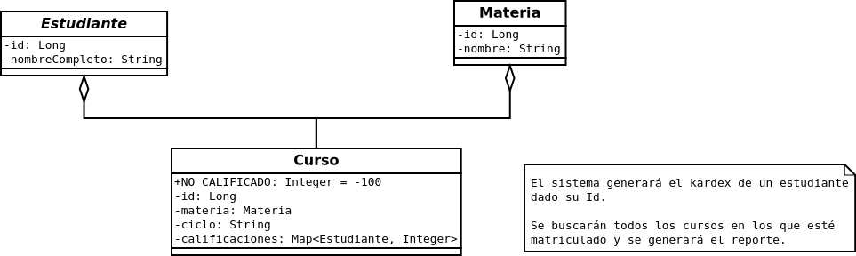

    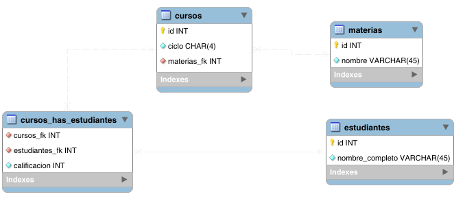

    a. Curso
    
    b. Estudiante
    
    c. Materia

3. También generaron los repositorios correspondientes:

    a. CursoRepository
    
    b. EstudianteRepository

    c. MateriaRepository

Ejecuta el proyecto con el comando:
```
mvn spring-boot:run
```

   

   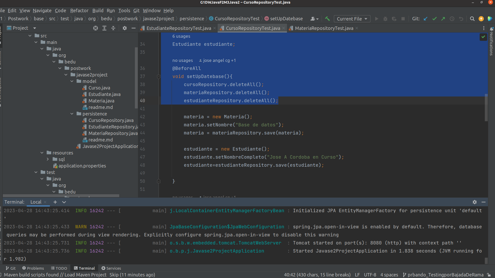

4. Se generaron los siguientes casos de prueba:

    - Crear y almacenar (Por lo menos uno de cada uno):
        - Estudiante
        - Materia
        - Curso
        
    - Una vez creado el curso, agregar la calificación del estudiante.

 Ejecutamos las pruebas con los siguientes comandos:

```
mvn test
```
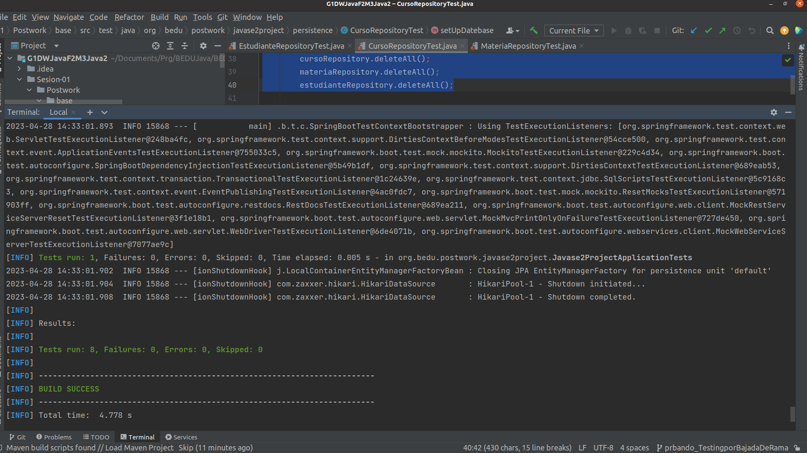
```
mvn test -D "MateriaRepositoryTest"
```
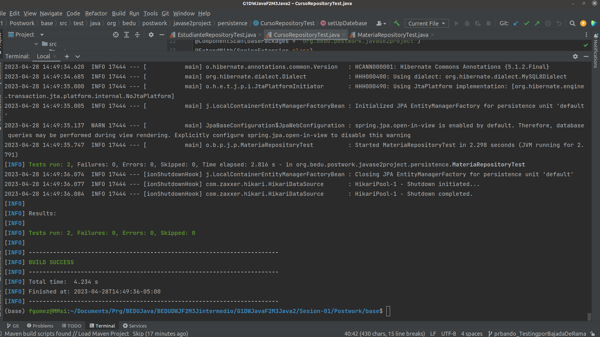
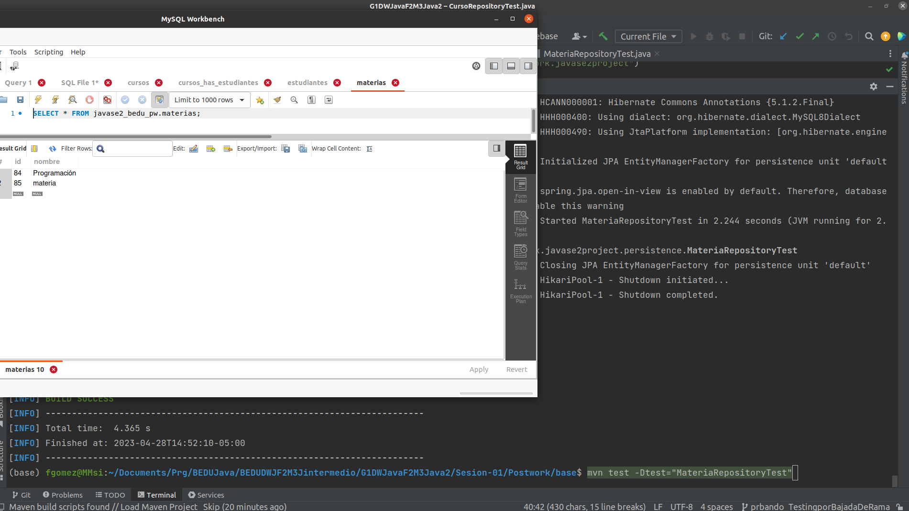
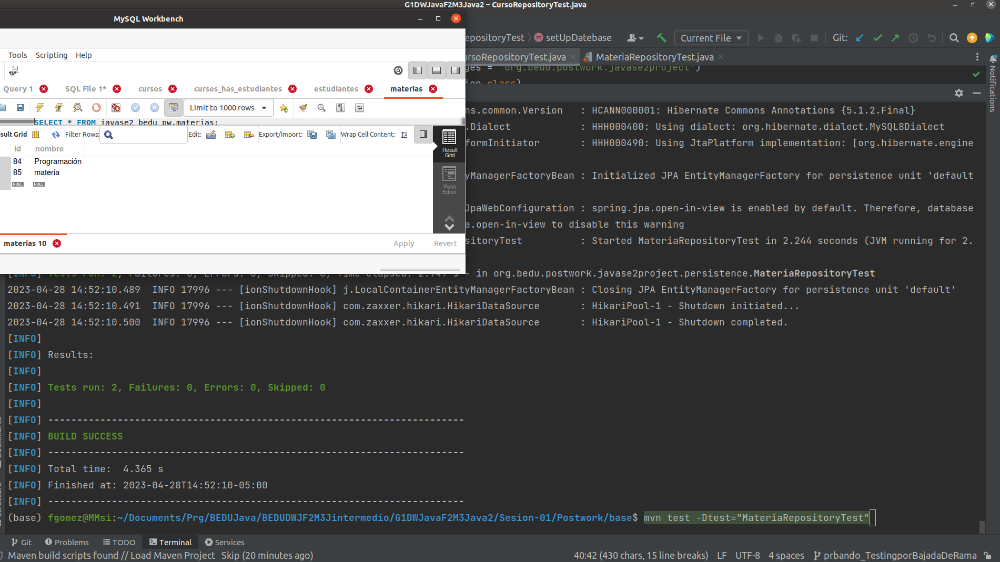
```
mvn test -D "EstudianteRepositoryTest"
```
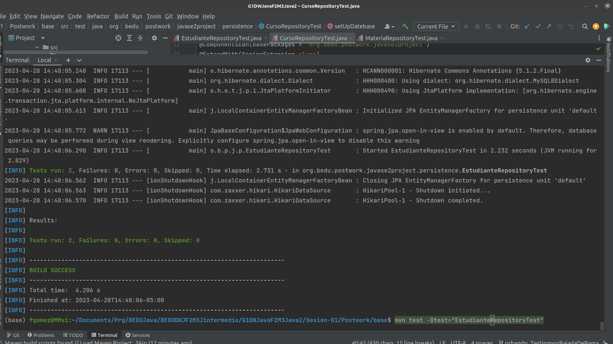


```
mvn test -D "CursoRepositoryTest"
```
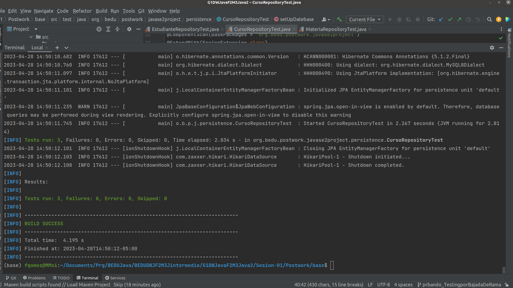

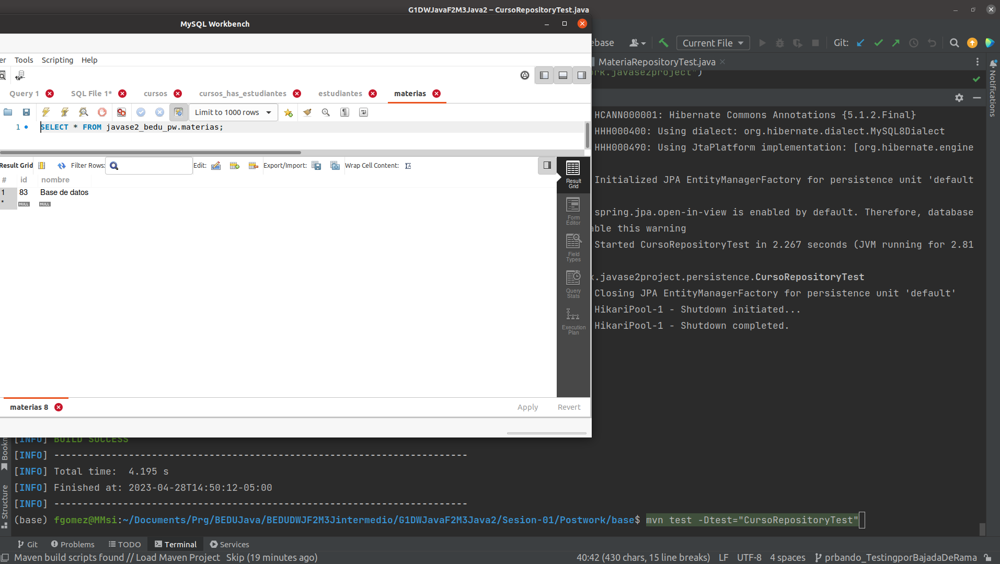


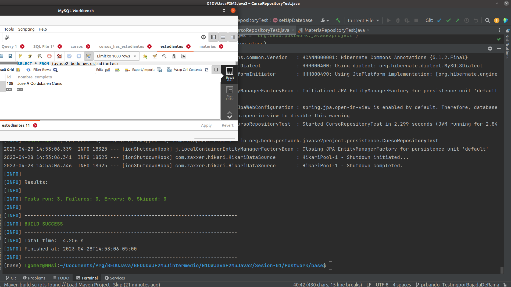

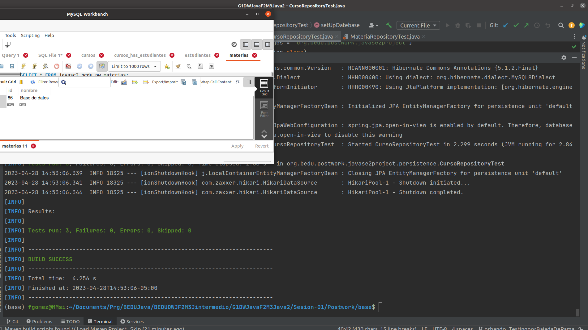


5. Para finalizar, se recomienda que como equipo busquen información sobre las siguientes anotaciones. 
REVISAR Y AGREGAR INFO
    - @ElementCollection
    
    - @CollectionTable
    
    - @MapKeyJoinColumn.

<br/>
<br/>
REVISAR CONEXION CON MENU PRIN
[Regresar ](../Readme.md)(Sesión 01)

[Siguiente ](../../Sesion-02/Readme.md)(Sesión 02)
