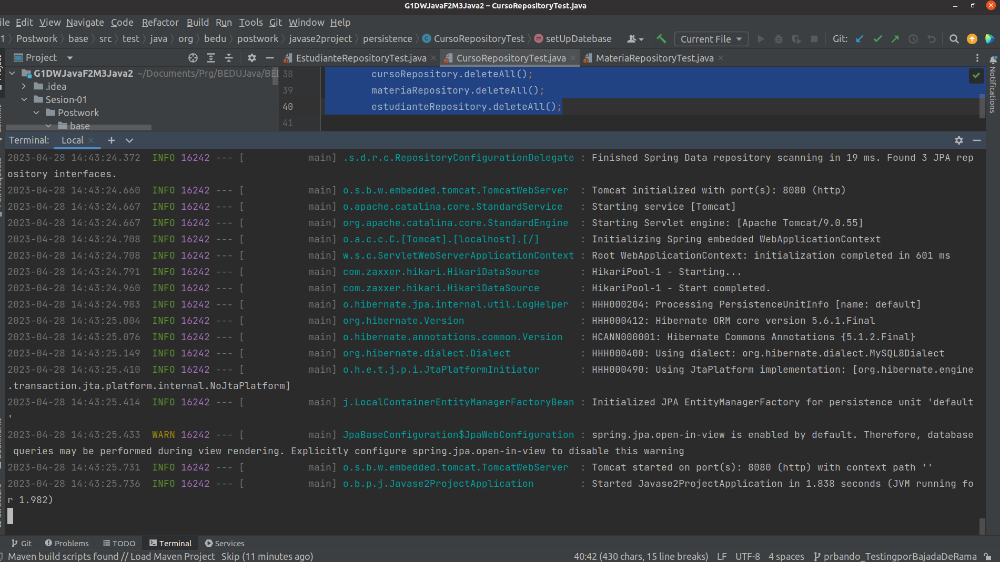

# Postwork 01: Gestión de bases de datos

## 🎩 Objetivo

- Practicar las consultas CRUD sobre la base de datos.
- Crear las entidades y repositorios que usaremos para el proyecto.

## 🎯 Requisitos

- MySQL instalado y configurado
- Apache Maven 3.8.4 o superior
- JDK (o OpenJDK)

## 🚀 Desarrollo

1. Se clonó el proyecto de la carpeta [base].


2. A partir de los diagramas se generaron las entidades/modelosdel proyecto.

    

    

    a. Curso
    
    b. Estudiante
    
    c. Materia

3. También generaron los repositorios correspondientes:

    a. CursoRepository
    
    b. EstudianteRepository

    c. MateriaRepository

### 🚀 Instrucciones de uso.

1. Descarga el archivo correspondiente al Postwork 4.


2. Ejecuta el proyecto con el comando:
```
mvn spring-boot:run
```

   

   

3. Analiza los casos de prueba desarrollados:

    - Crear y almacenar (Por lo menos uno de cada uno):
        - Estudiante
        - Materia
        - Curso
        
    - Una vez creado el curso, agregar la calificación del estudiante.


4. Ejecuta las pruebas con los siguientes comandos:

```
mvn test
```


5. Observa los resultados de cada prueba ejecutada.
```
mvn test -D "MateriaRepositoryTest"
```


```
mvn test -D "EstudianteRepositoryTest"
```


```
mvn test -D "CursoRepositoryTest"
```


6. Para finalizar, recuerda la siguiente información.
    - @ElementCollection:
Nos permite guardar una lista de valores en forma de entidad.     
    - @CollectionTable:
Especifica la tabla que se usa para realizar el *map* de una colección de atributos básicos.    
    - @MapKeyJoinColumn.
Especifica el *mapping* hacia una entidad que representa la llave.  

<br/>

[Siguiente ](../Sesion-02/Readme.md)(Sesión 02)

[Regresar a root ](../Readme.md)(Principal)