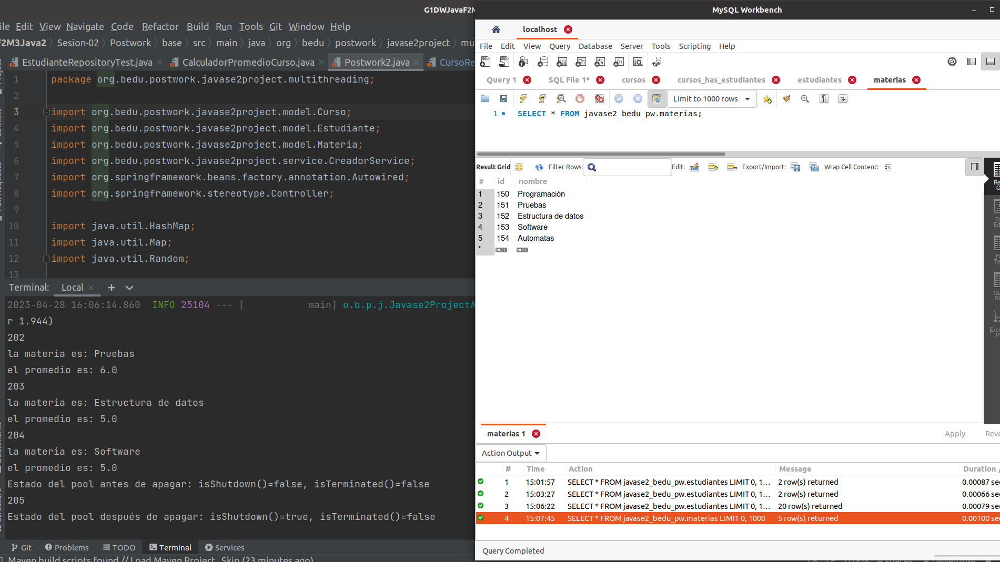
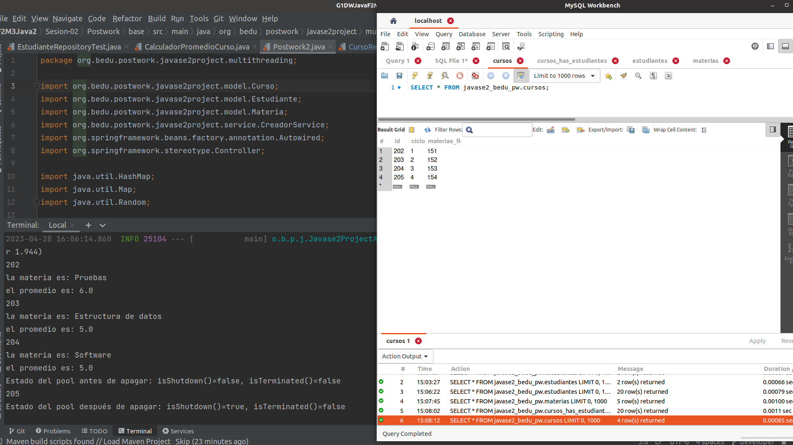
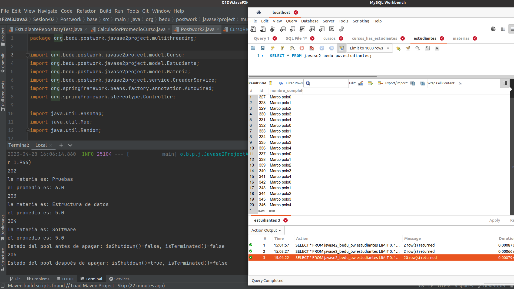
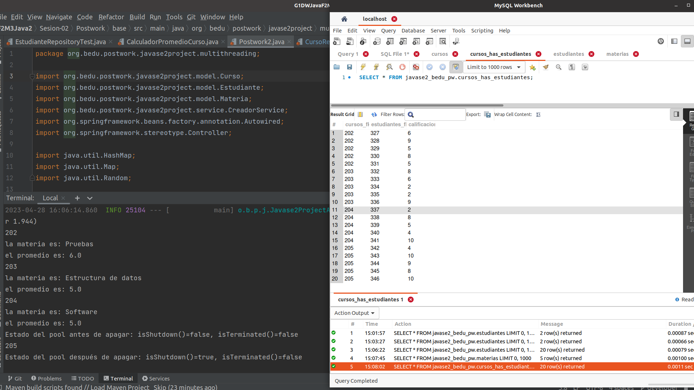
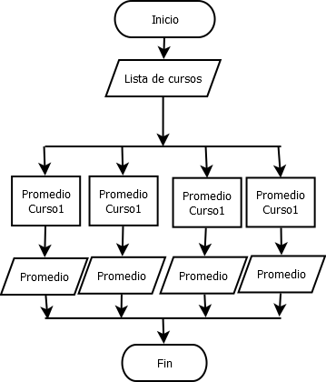

# Postwork Sesión 02: Cálculo de promedios mediante hilos 

## 🎩 Objetivo 

- Practicar el uso de hilos con Java.
- Calcular promedios a través de múltiples hilos en su proyecto.

## 🎯 Requisitos 

- MySQL instalado y configurado
- Apache Maven 3.8.4 o superior
- JDK (o OpenJDK)

## 🚀 Desarrollo

1. Agregamos al postwork anterior.

2. Generamos un nuevo package: *multithreading*.

3. Creamos la clase *CalculadorPromedioCurso* que implementa un Runnable, su constructor deberá obtener el curso, con las calificaciones a promediar; además, el run deberá calcular el promedio y mostrar el resultado junto con el nombre del curso.

   

   

4. Además de una clase *Postwork2* la cual creá los cursos (cuatro como mínimo) con calificaciones aleatorias para cada uno de sus estudiantes. Como muestra dejaremos 20 estudiantes por curso.

   

5. Ejecutamos el Runnable con un ExecutorService. Donde cada hilo deberá calcular cada curso.

   

 

A continuación dejamos una imagen donde pueden visualizar el flujo general que tomará la aplicación.

   

 
REVISAR CONEXION

[Regresar ](../Readme.md)(Sesión 02)

[Siguiente ](../../Sesion-03/Readme.md)(Sesión 03)
