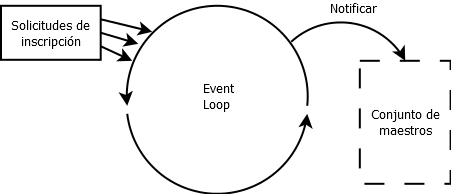
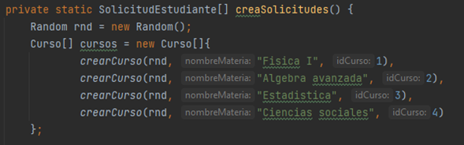
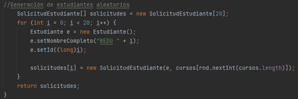
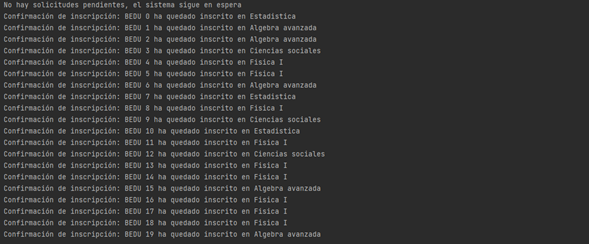

# Postwork Sesión 04: Inscripción de estudiantes

## 🎩 Objetivo

- Aplicar los conocimientos de la programación asíncrona mediante un proyecto real.
- Practicar el uso del EventLoop, a través de su uso para implementar un sistema de registro de alumnos.

## 🎯 Requisitos

- IntelliJ IDEA Community Edition
- JDK (o OpenJDK)
- Postwork de la sesión 3

## 🚀 Desarrollo

**Realizar en equipo**

El director de la escuela solicitó que implementen un sistema de inscripción de alumnos que notifique al maestro cuando un alumno se haya inscrito a un curso y además le muestre la cantidad de alumnos que tiene su curso sin bloquear la plataforma para que más estudiantes puedan inscribirse al mismo tiempo.

Es por esto que han considerado que la implementación más fácil será mediante el uso de un **EventLoop** que reciba la información del alumno y el curso al que se quiere inscribir, notificando en un **worker** al maestro de la inscripción.

Su tarea consiste en implementar el EventLoop necesario para esta plataforma, así como el worker que notifique al maestro.

El diagrama 1 muestra cómo sería el flujo del EventLoop

 

### 🚀 Instrucciones de uso.

1. Descarga el archivo correspondiente al Postwork 4.

2. Ingresa al paquete **async.**

3. Dentro de la clase **InscripcionAlumnos** modifica el método **CreaSolicitudes** con los cursos deseados.

4. Modifica las características de los estudiantes que serán registrados.

5. Ejecuta el método **main** contenido en la misma clase **InscripcionAlumnos.

6. Observa en la consola la notificación de confirmación de cada estudiante en un curso específico.

 
       

[Regresar ](../Readme.md)(Sesión 04)

[Siguiente ](../Sesion-05/Readme.md)(Sesión 05)
