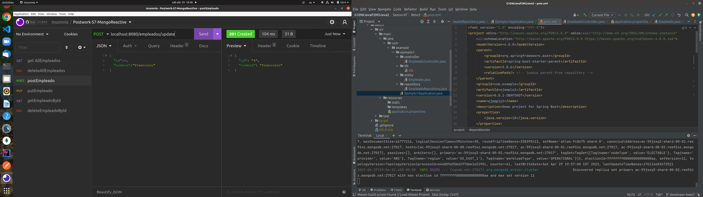
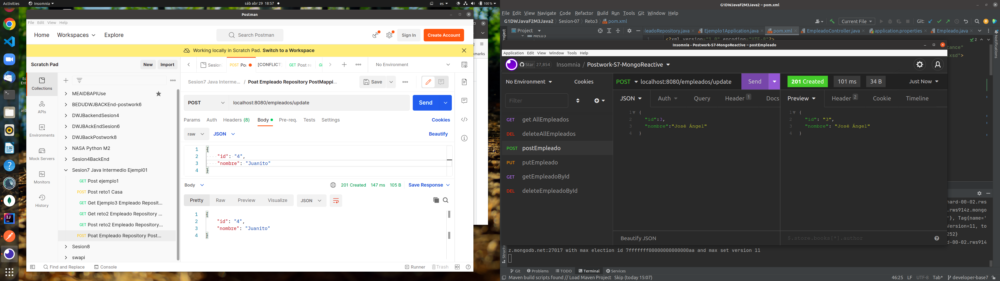
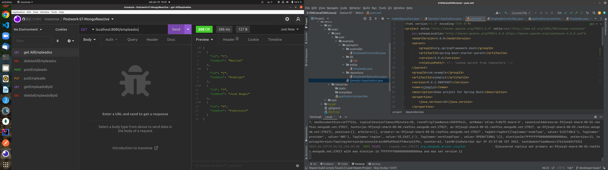
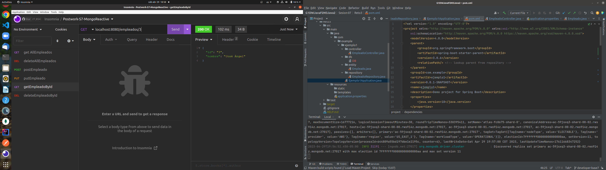
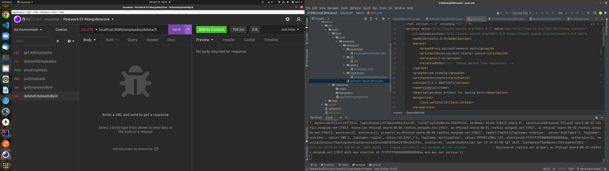
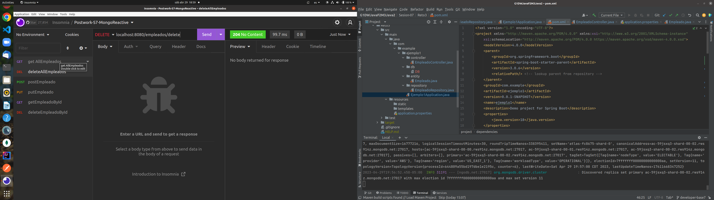
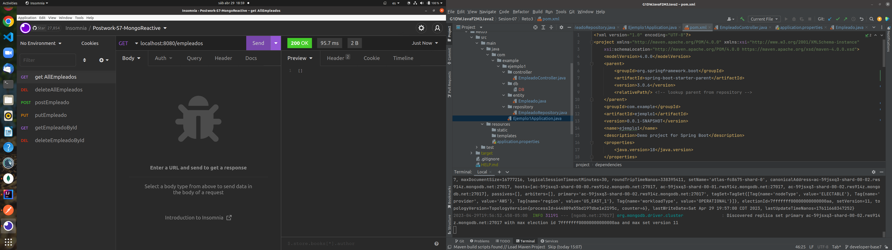
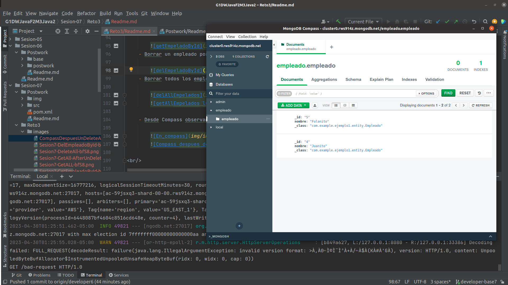
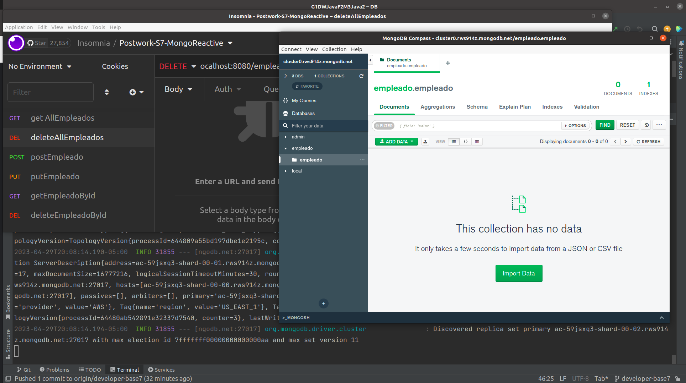

# Postwork 07: Microservicios

## 🎩 Objetivo

- Realizar microservicios a un servidor de MongoDB, para almacenar y consultar registros alojados en la base de datos.
## 🎯 Requisitos 

- MongoDB Atlas
- IntelliJ IDEA Community Edition
- JDK (o OpenJDK)
- Reto 03

## 🚀 Desarrollo

1. En el archivo **pom.xml** agregamos la dependencia ``mongodb-reactive``` al inicio de las dependencias:

    ```xml
    <dependency>
        <groupId>org.springframework.boot</groupId>
        <artifactId>spring-boot-starter-data-mongodb-reactive</artifactId>
    </dependency>
    ```

2. En MongoDB Atlas creamos una base de datos y una coleccion llamada "empleado"

3. Modificamos la clase EmpleadoRepository que traiamos del Reto3 como una interfaz extendida de ``` ReactiveMongoRepository```:

    ```java
    package com.example.demo.repository;

    import com.example.demo.entity.Empleado;
    import org.springframework.data.mongodb.repository.ReactiveMongoRepository;
    import org.springframework.stereotype.Repository;

    @Repository
    public interface EmpleadoRepository extends ReactiveMongoRepository<Empleado, String>{

    }
    ```

5. Ahora generamos el uri de conexión de MongoAtlas, al archivo **application.properties** lo encontrarás dentro de **resources**.

    ```properties
    spring.data.mongodb.uri=mongodb+srv://<user>:<password>@cluster0.ijbvb.mongodb.net/empleado?retryWrites=true&w=majority
    ```
7. Agregamos los métodos al Controlador EmpleadoController

   ```java
   @GetMapping
    @ResponseStatus(HttpStatus.OK)
    private Flux<Empleado> getAllEmpleados(){
        return empleadoRepository.findAll();
    }
    @GetMapping("/{id}")
    @ResponseStatus(HttpStatus.OK)
    private Mono<Empleado> getEmpleadoById(@PathVariable("id") String id){
        return empleadoRepository.findById(id);
    }
    @PostMapping("/update")
    @ResponseStatus(HttpStatus.CREATED)
    private Mono<Empleado> createEmpleado(@RequestBody Empleado empleado){
        return empleadoRepository.save(empleado);
    }
   /*@PutMapping("/update/{id}")
   @ResponseStatus(HttpStatus.OK)
    private Mono<Empleado> putEmpleado(@PathVariable("id") String id,@RequestBody Empleado empleado){
        return empleadoRepository.update(empleado);
    }*/

    @DeleteMapping("/delete/{id}")
    @ResponseStatus(HttpStatus.NO_CONTENT)
    private Mono<Void> deleteEmpleado(@PathVariable("id") String id){
        return empleadoRepository.deleteById(id);
    }
    @DeleteMapping("/delete")
    @ResponseStatus(HttpStatus.NO_CONTENT)
    private Mono<Void> deleteAllEmpleados(){
        return empleadoRepository.deleteAll();
    }
   ```
   
8. probamos los endpoints creados en MongoDB Atlas.

    - Crear empleados POST GET http://localhost:8080/empleados/update createEmpleado

        
      

    - Consultar todos los empleados GET http://localhost:8080/empleados  getAllEmpleados
    
        

    - Consultar empleado por id GET http://localhost:8080/empleados/#  getEmpleadoById
    
        
    - Borrar un empleado por id DEL http://localhost:8080/delete/#  deleteEmpleadoById

        
    - Borrar todos los empleados DEL http://localhost:8080/delete  delAllEmpleados

        
        

    - Desde Compass observamos los documentos/registros en MongoDB Atlas

        
        

<br/>

## ✅ Checklist 

Asegúrate que el postwork contenga todo lo siguiente, ya que esto se evaluará al término del módulo.

- [✅] El proyecto no muestra warnings ni errores durante su ejecución.
- [✅] El proyecto logra conectarse al servidor de MongoDB.
- [✅] Es posible registrar un empleado con POST al API.
- [✅] Es posible consultar todos los empleados con GET.
- [✅] Es posible consultar un empleado por su ID con GET.
- [✅] Es posible eliminar un empleado por su ID con DEL.
- [✅] Es posible eliminar todos los empleados con DEL.

<br/>

[Regresar ](../Sesion-06/Readme.md)(Sesión 06)

[Siguiente ](../Sesion-08/Readme.md)(Sesión 08)

[Regresar a root ](../Readme.md)(Principal)